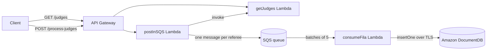

# final-juiz: serverless referee-stats pipeline on AWS

Study project that defines a small event-driven backend on AWS with the **AWS CDK (JavaScript)**. It serves football-referee statistics (average yellow and red cards, fouls and VAR incidents per referee) and processes them through a queue into a document database.

## Architecture



1. `GET /judges`: `getJudges` returns the referee records (mock data).
2. `POST /process-judges`: `postInSQS` invokes `getJudges` (Lambda-to-Lambda with AWS SDK v3) and sends one SQS message per referee in parallel. It returns `200`, or `207` on partial failure.
3. `consumeFila` reads the queue in batches (batch size 5, 1-minute batching window), writes each referee to DocumentDB through the MongoDB driver, deletes processed messages and reports `batchItemFailures`, so only failed messages are retried.

## Infrastructure (`lib/`)

- **`DocdbStack`:** VPC across 2 AZs, a security group and a DocumentDB cluster (t3.medium).
- **`JudgesApiCdkStack`:** the three Lambdas, the SQS queue (30 s visibility timeout), a REST API (stage `prod`, CORS enabled), least-privilege IAM grants (invoke, send messages, read the cluster secret), and CloudFormation outputs for the API URLs, queue and function names.

**Stack:** JavaScript · AWS CDK · AWS Lambda (Node.js) · Amazon SQS · Amazon API Gateway · Amazon DocumentDB · AWS SDK v3

## Commands

```bash
npm install
npx cdk synth    # emit the CloudFormation template
npx cdk deploy   # deploy to the default AWS account/region
```

## Status

Learning project (May 2025), not deployed. Known gaps before a real deployment:

- The `consumeFila` handler must be referenced as `consumeFila.handler`.
- `consumeFila` declares its `environment` block twice, so the Mongo connection variables end up undefined. It should read the DocumentDB secret instead.
- Two DocumentDB clusters are defined in different VPCs; one should go.
- The `mongodb` driver must be bundled with the function (for example with `NodejsFunction`).

A TypeScript variant of the same idea lives in [aws-juiz-service](https://github.com/BeatrizVocurcaFrade/aws-juiz-service).
